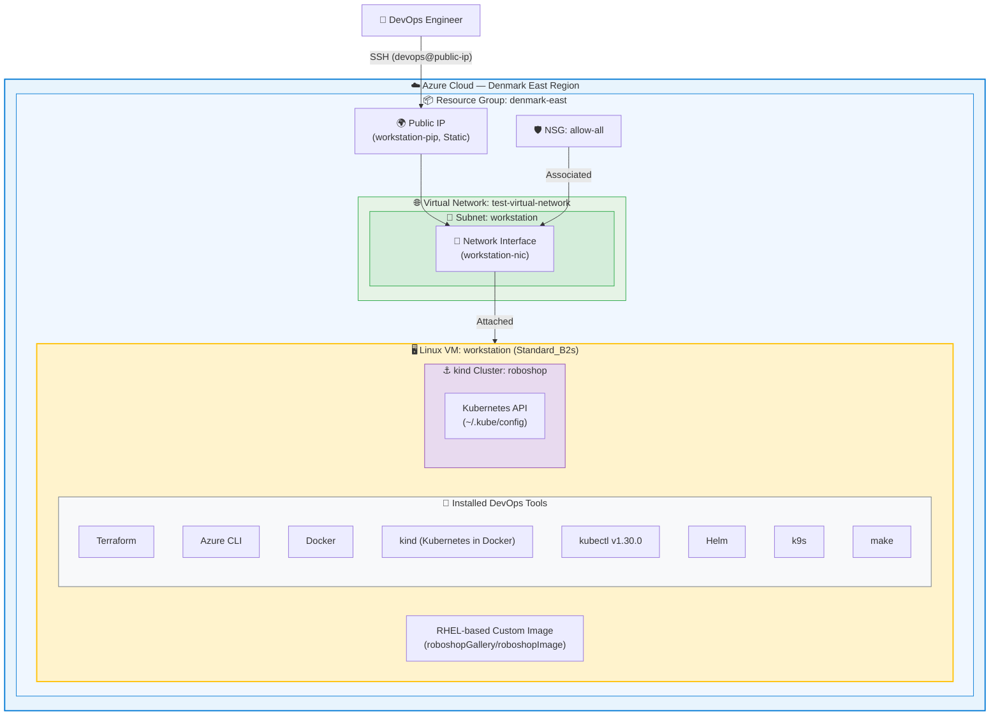
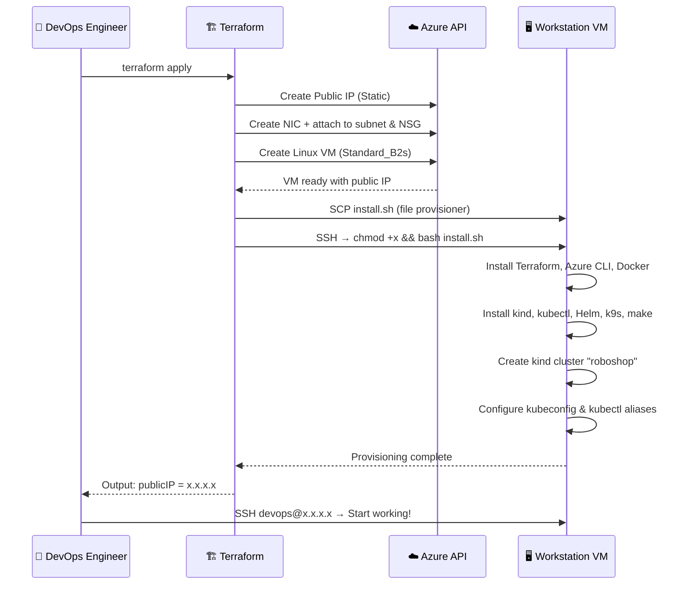

# 🚀 RoboShop Azure Workstation

Terraform-based Infrastructure-as-Code (IaC) project that provisions a fully configured **DevOps workstation** on **Microsoft Azure**. The workstation VM is automatically bootstrapped with essential DevOps tools including Terraform, Azure CLI, Docker, Kubernetes (kind), kubectl, Helm, k9s, and more — ready for developing and deploying the [RoboShop](https://github.com/instana/robot-shop) microservices application.

---

## 📐 Architecture Diagram



### Data Flow



---

## 📁 Project Structure

| File | Purpose |
|---|---|
| [`main.tf`](file:///e:/GitRepos/roboshop-azure-workstation/main.tf) | Core Terraform configuration — defines all Azure resources and provisioners |
| [`variables.tf`](file:///e:/GitRepos/roboshop-azure-workstation/variables.tf) | Input variables (resource group, location, component map) |
| [`output.tf`](file:///e:/GitRepos/roboshop-azure-workstation/output.tf) | Outputs the workstation's public IP address |
| [`install.sh`](file:///e:/GitRepos/roboshop-azure-workstation/install.sh) | Bootstrap script — installs all DevOps tools on the workstation VM |
| [`jenkins.sh`](file:///e:/GitRepos/roboshop-azure-workstation/jenkins.sh) | Jenkins CI server installation script (currently unused, for optional Jenkins VM) |
| [`.gitignore`](file:///e:/GitRepos/roboshop-azure-workstation/.gitignore) | Excludes Terraform state files, provider binaries, and lock files from Git |

---

## 🧩 Key Components

### 1. Terraform Resources (`main.tf`)

| Resource | Type | Description |
|---|---|---|
| `azurerm_public_ip.main` | Public IP | Static public IP for SSH access — created via `for_each` over the `component` variable |
| `azurerm_network_interface.main` | NIC | Network interface attached to the `workstation` subnet with dynamic private IP |
| `azurerm_network_interface_security_group_association` | NSG Association | Associates the NIC with the `allow-all` NSG |
| `azurerm_linux_virtual_machine.workstation` | Linux VM | The main workstation VM (`Standard_B2s`, 2 vCPUs / 4 GB RAM) |
| `null_resource.ws_name` | Null Resource | Triggers remote provisioning — runs `install.sh` on every `terraform apply` |

> [!NOTE]
> A **Jenkins VM** definition exists in `main.tf` but is **commented out**. It can be enabled by uncommenting lines 87–134 to provision a separate Jenkins CI server alongside the workstation.

### 2. Bootstrap Script (`install.sh`)

The script runs automatically on the VM after creation and installs:

| Tool | Version | Purpose |
|---|---|---|
| **Terraform** | Latest (HashiCorp repo) | Infrastructure as Code |
| **Azure CLI** | Latest (Microsoft repo) | Azure resource management |
| **Docker CE** | Latest (Docker repo) | Container runtime |
| **kind** | v0.31.0 | Kubernetes-in-Docker — local clusters |
| **kubectl** | v1.30.0 | Kubernetes CLI |
| **Helm** | Latest (get-helm-4) | Kubernetes package manager |
| **k9s** | Latest (GitHub release) | Terminal-based Kubernetes UI |
| **make** | System package | Build automation |

The script also:
- Creates a **kind cluster** named `roboshop`
- Configures `~/.kube/config` for the `devops` user
- Adds a `k` → `kubectl` alias with bash autocompletion
- Adds the `devops` user to the `docker` group

### 3. Variables (`variables.tf`)

| Variable | Default | Description |
|---|---|---|
| `resource_group_name` | `denmark-east` | Azure resource group name |
| `location` | `Denmark East` | Azure region |
| `component` | `{ workstation = "Standard_B1s", jenkins = "Standard_B2s" }` | Map of component names to VM sizes (used for `for_each` on shared resources) |

### 4. Outputs (`output.tf`)

| Output | Description |
|---|---|
| `publicIP` | The public IP address of the workstation VM (use this to SSH in) |

---

## 📋 Prerequisites

Before using this project, ensure you have:

- [x] **Terraform** ≥ 1.0 installed locally
- [x] **Azure CLI** installed and authenticated
- [x] An **Azure subscription** with the following pre-existing resources:
  - Resource Group: `denmark-east`
  - Virtual Network: `test-virtual-network` (in `denmark-east`)
  - Subnet: `workstation`
  - Network Security Group: `allow-all`
  - Shared Image Gallery: `roboshopGallery` with image `roboshopImage`

---

## 🚀 Getting Started

### 1. Authenticate with Azure

```bash
az login --tenant "39327c73-7743-4d89-9607-d01ea0747b9d" --scope "https://graph.microsoft.com/.default"
```

### 2. Initialize Terraform

```bash
terraform init
```

### 3. Review the Execution Plan

```bash
terraform plan
```

### 4. Deploy the Workstation

```bash
terraform apply -auto-approve
```

> Terraform will output the workstation's public IP after a successful apply.

### 5. SSH into the Workstation

```bash
ssh devops@<PUBLIC_IP>
# Password: Devops@12345
```

### 6. Verify the Setup

Once SSH'd in, verify the installed tools:

```bash
terraform --version
az --version
docker --version
kind --version
kubectl version --client
helm version
k9s version
kubectl get nodes    # Should show the kind cluster node
```

---

## 🔄 Re-provisioning

The `null_resource.ws_name` uses `triggers = { always = timestamp() }`, which means **every `terraform apply`** will re-run `install.sh` on the workstation. This is useful for updating tools or re-applying configuration, but be aware it will recreate the kind cluster each time.

---

## 🗑️ Tear Down

To destroy all provisioned resources:

```bash
terraform destroy -auto-approve
```

---

## ⚠️ Important Notes

> [!WARNING]
> **Security**: The VM uses password authentication (`Devops@12345`) and an `allow-all` NSG. This configuration is intended for **development/learning environments only**. For production use:
> - Use SSH key-based authentication
> - Restrict NSG rules to specific IP ranges
> - Store secrets in Azure Key Vault

> [!IMPORTANT]
> **Hardcoded IDs**: The `subnet_id`, `network_security_group_id`, and `source_image_id` in `main.tf` contain hardcoded Azure subscription and resource IDs. You **must** update these to match your own Azure environment before deploying.

> [!NOTE]
> **Custom Image**: The VM boots from a custom image (`roboshopGallery/roboshopImage`) stored in an Azure Shared Image Gallery. This image is expected to be RHEL-based (the install script uses `yum`/`dnf`).

---

## 🔧 Optional: Enable Jenkins VM

To provision an additional Jenkins CI server:

1. Uncomment lines **87–134** in [`main.tf`](file:///e:/GitRepos/roboshop-azure-workstation/main.tf#L87-L134)
2. The Jenkins VM will use the `jenkins.sh` script to install:
   - Java 21 (OpenJDK)
   - Jenkins (LTS from official RPM repo)
3. Run `terraform apply`
4. Access Jenkins at `http://<JENKINS_PUBLIC_IP>:8080`

---

## 🛠️ Technology Stack

| Category | Technology |
|---|---|
| **IaC** | Terraform (AzureRM provider v4.71.0) |
| **Cloud** | Microsoft Azure |
| **VM OS** | RHEL-based (custom image) |
| **Container Runtime** | Docker CE |
| **Kubernetes** | kind (Kubernetes in Docker) |
| **CI/CD** (optional) | Jenkins |

---

## 📜 License

This project is provided as-is for educational and development purposes.